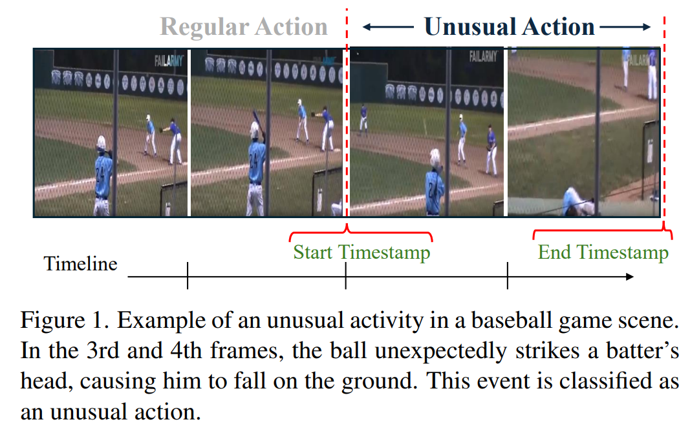
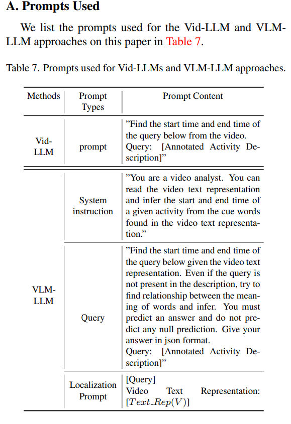

<div align="center">

# UAL-Bench: The First Comprehensive Unusual Activity Localization Benchmark
[**Hasnat Md Abdullah**](https://github.com/Hasnat79)<sup>1</sup> · [**Tian Liu**](https://tian1327.github.io/)<sup>1</sup> · [**Kangda Wei**](https://weikangda.github.io/kangda.github.io//)<sup>1</sup> · [**Shu Kong**](https://aimerykong.github.io/)<sup>2</sup> · [**Ruihong Huang**](https://scholar.google.com/citations?user=NU2aHWUAAAAJ&hl=en)<sup>1</sup>

<sup>1</sup>Texas A&M University&emsp;&emsp;&emsp;<sup>2</sup>University of Macau


[](https://arxiv.org/abs/2410.01180)

[](https://huggingface.co/datasets/hasnat79/ual_bench)


</div>

## 📜 Abstract
Localizing unusual activities in videos, such as abnormal behaviors or traffic incidents, holds practical significance. 
However, pretrained foundation models struggle with localizing diverse unusual events likely because of their insufficient representation in the models' pretraining datasets. 
To explore foundation models' capability in localizing unusual activities, 
we introduce UAL-Bench, a comprehensive benchmark for unusual activity localization, featuring three video datasets (UAG-OOPS, UAG-SSBD, and UAG-FunQA), and an instruction-tuning dataset (OOPS-UAG-Instruct), to improve model capabilities. 
We also introduce a new metric, $R@1, TD\leq p$, as an auxiliary metric to reasonably consider detections as true positive if their starting and ending timestamp are within a threshold.
% to address limitations in existing evaluation methods. 
On UAL-Bench, we evaluate three approaches: Video-Language Models (Vid-LLMs), instruction-tuned Vid-LLMs, and a novel integration of Vision-Language Models and Large Language Models (VLM-LLM). Our results show the VLM-LLM approach excels in localizing short-span unusual events and predicting their onset (start time) more accurately than Vid-LLMs. Our findings highlight the challenges posed by long-duration videos, particularly in autism diagnosis scenarios, and the need for further advancements in localization techniques. Our work not only provides a benchmark for unusual activity localization but also outlines the key challenges for existing foundation models, 
suggesting future research directions on this important task.


## 🔧 Getting Started
- Clone this repository
```bash
git clone https://github.com/Hasnat79/UAL_Bench
```
- init the submodules (foundation_models)
```bash
git submodule update --init --recursive
```
## 🚀 Installation

To install the necessary dependencies, run:

```bash
source setup.sh
```
- creates a anaconda environment named `ual-bench` and installs the necessary dependencies.

## 📂 Dataset


[/data](data) directory contains the annotation json files and the brief details of the datasets for UAL-Bench. All the videos of each dataset are **available** on [hugging_face/ual_bench](https://huggingface.co/datasets/hasnat79/ual_bench). How to download: 
- go to [huggingface/ual_bench](https://huggingface.co/datasets/hasnat79/ual_bench)
- go to files and version 
- copy the download link of a dataset (e.g. uag_funqa.tar)
- go to terminal and download the tar file
```bash 
wget -O uag_funqa.tar https://huggingface.co/datasets/hasnat79/ual_bench/resolve/main/uag_funqa.tar?download=true
```
- untar the file
```bash
tar -xvf uag_funqa.tar
```
- More details can be found in [data/README.md](data/README.md)

### ⚙️ Data loaders
After setting the videos in the [data](data) directory, you can use the data loader modules from [/src/dataloaders](src/dataloaders) to directly load the videos and annotations in your code. For example:

```python
from src.dataloaders.uag_oops_loader import UAGOopsLoader
uag_oops = UAGOopsLoader()
for video_id, video_info in uag_oops:
    print(video_id, video_info)
```

## 🧠 VLM-LLM Pipeline
**Overview:** Generates a video text representation using VLM and then uses the LLM to generate the unusual activity localization predictions given the text representation + instruction. 

### Video Text Representation using VLM
- Uses two models: Blip2 and Videollama2
- The video text representation generation scripts can be found in [src/text_representation_builders/](src/text_representation_builders)
  - For blip2: [blip2_text_representations](src/text_representation_builders/blip2_text_representations) 
    - Model variant: Salesforce/blip2-opt-2.7b
  - For videollama2: [videollama2_text_representations](src/text_representation_builders/videollama2_text_representations)
    - Checkpoints to be saved inside [/foundation_models/Video-LLaMA](foundation_models/Video-LLaMA)
      - Video-LLaMA-2-7B-Finetuned (for details see [videollama repo](https://github.com/DAMO-NLP-SG/Video-LLaMA))
    - you do not need to setup the eval configs, we have taken care of them inside [video_llama2_loader.py](src/model_loaders/video_llama2_loader.py)

  - <Details>
    <summary> Click to expand the code examples </summary>

    #### Blip2 Text Representation
    ```bash
    cd src/text_representation_builders/blip2_text_representations
    python blip2_text_rep_x_uag_oops.py\
      --output ../../outputs/text_representations/blip2_text_rep_x_uag_oops.json
    ```
    #### Videollama2 Text Representation
    ```bash
    cd src/text_representation_builders/videollama2_text_representations
    python videollama2_text_rep_x_uag_oops.py\
      --output ../../outputs/text_representations/videollama2_text_rep_x_uag_oops.json
    ```
    </Details>

### Unusual Activity Localization using LLM 
- Uses Llama3 model [Meta-Llama-3-8B-Instruct]
  - make sure to save the model inside [/src/checkpoints/meta-llama/](src/checkpoints/meta-llama)
  - you can download the variants from [Meta-Llama-3-8B](https://huggingface.co/meta-llama/Meta-Llama-3-8B)
  - make sure `llama3_model_id` in the [configure.py](configs/configure.py) is set accordingly

- The unusual activity localization scripts can be found in [/src](/src)
- <details>
  <summary> Click to see the prompt and instructions used in LLM </summary>

  
  </details>
- <details>
  <summary>Click to expand the code examples</summary> 

    ```bash
    cd src
    python llama3_x_videollama2_text_rep_uag_oops.py\ 
    --input ../outputs/text_representations/videollama2_text_rep_x_uag_oops.json \
    --output ../outputs/vlm_llm_prediction_generations/videollama2_llama3_uag_oops.json
    ```
  </details>


## 🧪 Evaluation Pipeline
- evaluation script can be found in [/src/eval](src/eval)
- Example:

    ```bash
    cd src/eval
    python eval_your_results.py\
     --results_file ../../outputs/vlm_llm_prediction_generations/blip2_llama3_uag_oops.json
    ```

## 📝 Evaluate Your Model's result on UAL-Bench
We have provided a template: [output_test_template.json](src/eval/output_test_template.json) file. We recommend you to prepare your model's output in the same format. Then run the following:

```bash
cd src/eval
python eval_your_results.py\
  --results_file $your_output_file.json
```
- <details>
  <summary> Click to see the example output format </summary>
  
  Expected output format:
  ```bash 
  ========== recal@1 iou >= m ======================
  correct_count: 0 len(result): 6
  IoU = 0.3 R@1: 0.00; mIoU: 0.02
  correct_count: 0 len(result): 6
  IoU = 0.5 R@1: 0.00; mIoU: 0.02
  correct_count: 0 len(result): 6
  IoU = 0.7 R@1: 0.00; mIoU: 0.02
  ========== abs dist <= m ======================
  correct_count: 0 len(result): 6
  Threshold m = 0s R@1: 0.00 mean abs distances: 3.07
  correct_count: 0 len(result): 6
  Threshold m = 1s R@1: 0.00 mean abs distances: 3.07
  correct_count: 2 len(result): 6
  Threshold m = 3s R@1: 33.33 mean abs distances: 3.07
  correct_count: 6 len(result): 6
  Threshold m = 5s R@1: 100.00 mean abs distances: 3.07
  correct_count: 6 len(result): 6
  Threshold m = 7s R@1: 100.00 mean abs distances: 3.07
  ============ Onset (start_time) prediction accuracy ====================
  correct_within_1_sec_count: 1 len(result): 6
  correct_within_quarter_sec_count: 0 len(result): 6
  Accuracy within 1 sec: 16.67
  Accuracy within 0.25 sec: 0.0
  ```
 </details>
 

## ✒️ Citation
If you find our work helpful for your research, please consider citing our work.
```markdown
@article{abdullah2024ual,
  title={Ual-bench: The first comprehensive unusual activity localization benchmark},
  author={Abdullah, Hasnat Md and Liu, Tian and Wei, Kangda and Kong, Shu and Huang, Ruihong},
  journal={arXiv preprint arXiv:2410.01180},
  year={2024}
}
``` 


